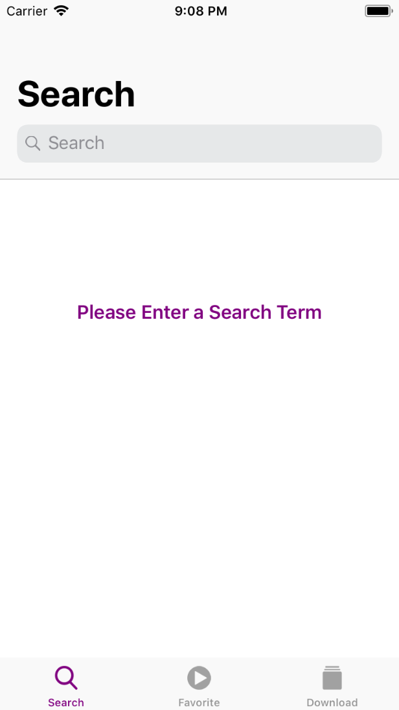
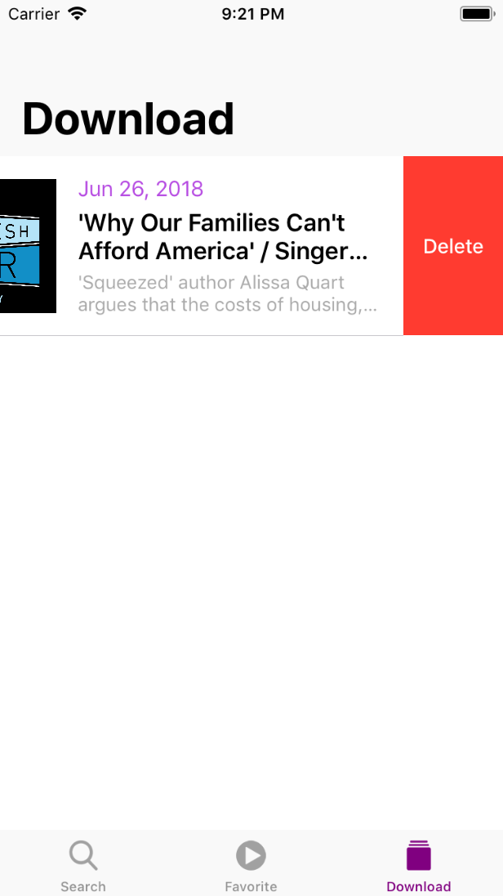

# Podcaster

Basic podcast app for searching your favorite podcasts on iTunes. Every podcast can be persisted locally and played in background mode of app even while locked.

# App workflow
## SearchView

When entering app first will be shown the search section where you can search for your favorite podcasts. After search completed you can choose which podcasts artist videos you want to open. After choosing artist you are able to see hes videos. By clicking on video you are opening podcast details view.

      

## Podcast Detials View
When running your favorite episode a view with audio players is shown. While fetching the data the image is animated, after it bounces to full size the audio file is prepared. The view shows the basic manipulation with audio data like time slider, play/pause, forward and backward track for 15 min and manipulation of volume. The whole view reacts on pan gestures and while in dissmiss mode the view is minimized but shows the basic informations of the podcast.

     
 
 ## Favorite View
 In this view the favorite podcast artist are show, whenever an artist is followed a new badge will show in this section. The favorite cells can be deleted by long pressing on cell, after that an appropriate alertSheet will show.
 
      
  
 ## Download View
  Every podcast episode can be locally stored on the device and it is shown on the Download tab section. Every downloaded episode can be deleted by dragging on the left side of it.
  
       
  
## Playback View
  While listening to podcasts playback is enabled when app enters background mode.

   
  
# Main Features:
- Alamofire Integration to greatly simplify network requests architecture
- AVKit Audio Player libraries for audio playback
- Offline Playback of podcasts enabled through download feature
- Control playback when App is in background
- Draggable Floating Player component accessible across all screens
- Search for Podcasts through iTunes API
- Parsing JSON asynchr
- Learn to use XML parsing Pods through Cocoapods integration
- Persistence with UserDefaults
